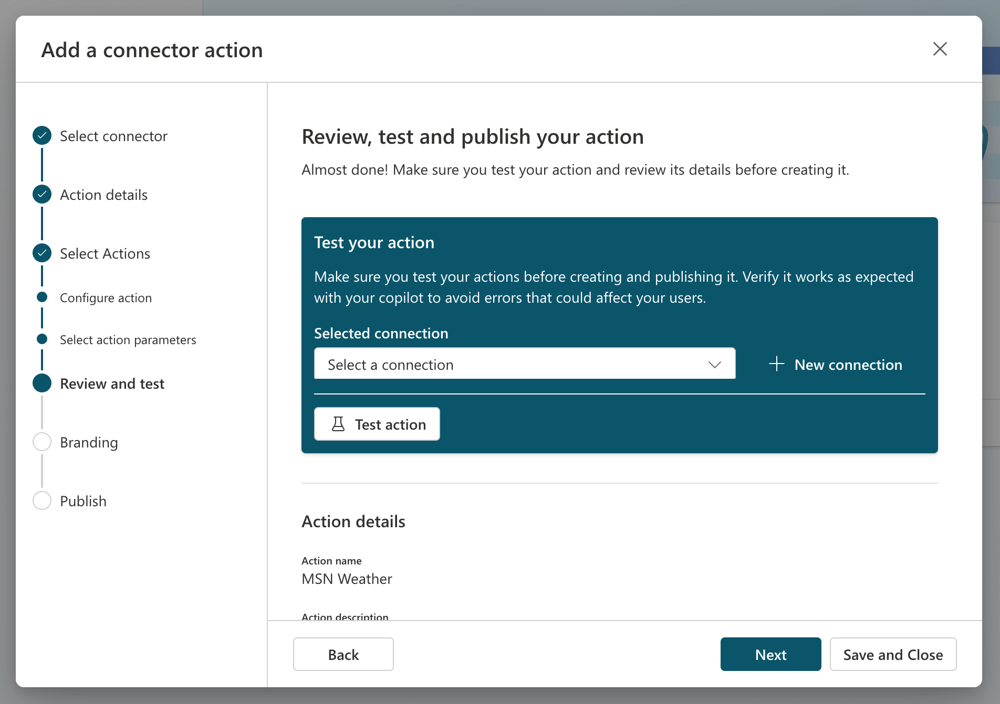
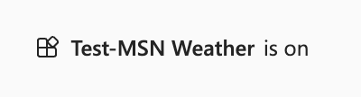
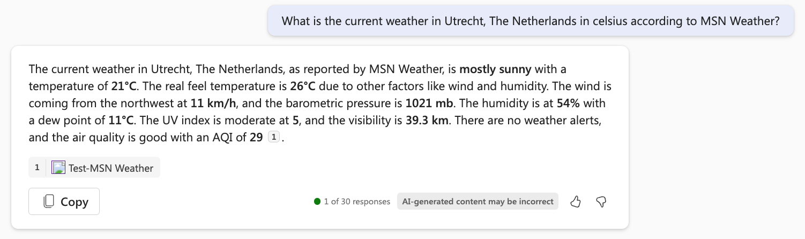
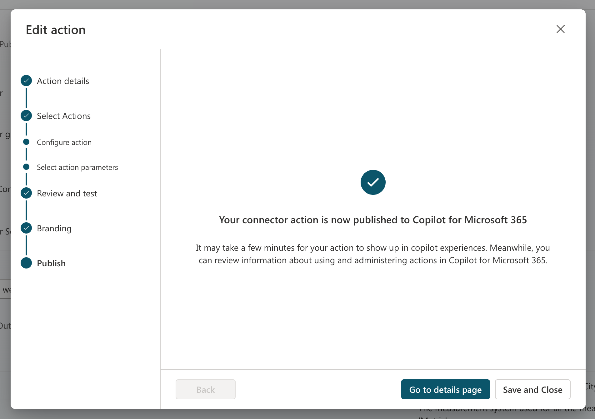

# Exercise: Create a connector action

In this exercise, you will:

- Create a connector action in Copilot Studio
- Test the connector action in Microsoft Teams
- Save and publish the connector action

## Task 1: Create a connector action in Copilot Studio

In this task, you will configure a connector action for the MSN Weather connector.

1. Go to [Copilot Studio](https://copilotstudio.microsoft.com)
1. Select **Library** in the left navigation. This is the place where you have to be when you want to extend a first-party Copilot.
1. Select **Add an item** at the top.
1. Select **Copilot for Microsoft 365** in the Copilot selection screen.
1. Select **Connector** to open the wizard for connector actions.
1. Select **MSN Weather** as the connector.
1. **Review** the description.

    > [!IMPORTANT]
    > Review the description in the following screen. This description is very important because Copilot for Microsoft 365 will use this to match the user message with your plugin. If you don't have a good description, Copilot for Microsoft 365 might not trigger your connector action.

1. Select **Next** when you're happy with the description.
1. Select the **Get current weather** action.
1. **Review** the action description.

    > [!IMPORTANT]
    > Review the action description in the following screen. This action description is very important because Copilot for Microsoft 365 will use this to match the user message with your action. If you don't have a good action description, Copilot for Microsoft 365 might trigger the wrong action.

1. Select **Next** when you're happy with the action description.
1. **Review** the descriptions of all the inputs and outputs.

    > [!IMPORTANT]
    > Review the input and output descriptions in the following screen. These input and output descriptions is very important because Copilot for Microsoft 365 will use these for triggering the connector (inputs) and for writing a good response (outputs) to you. If you don't have a good input and output descriptions, Copilot for Microsoft 365 might not trigger the connector correctly or it will not send back a good response.

1. Select **Next** when you're happy with the descriptions.
1. Next, you will see a screen where you can add more actions if you want to, but in this case we will skip this and select **Next**.

Now it's time for task 2, and we will work on testing the connector action. Leave you're browser open and continue with the next text.

## Task 2: Test the connector action in Microsoft Teams

In this task, you will test the connector action you configured in task 1 in Copilot for 365 in Microsoft Teams.

    

1. **Create a connection** for the MSN Weather connector if you don't have one yet or select an existing one.
1. Select the **Test action** button.

    > [!NOTE]
    > This will trigger a process where your connector action will get deployed to Microsoft Teams so that you can test it out.

1. Select **Open to test** to test.

    > [!NOTE]
    > This will open a new browser tab and it will try to launch Microsoft Teams.

1. Feel free to select **Cancel** in the pop-up where it tries to launch Microsoft Teams.
1. Select **Use the web app instead**.

    > [!NOTE]
    > This will open Copilot for Microsoft 365 in Microsoft Teams.

1. Select the **plugin** icon next to the send icon.
1. Enable the **Test-MSN Weather** plugin.

    > [!NOTE]
    > This will show the following message.

    


1. Replace your location and pick celsius or fahrenheit in the following message and send it to Copilot for Microsoft 365.

    ```text
    What is the current weather in <your location> in <celsius/fahrenheit> according to MSN Weather?
    ```

1. If all has gone well, you should see something like this:

   

## Task 3: Save and publish the connector action

In this task, you will save the connector action and publish it.

Let's pick up where we left off in Copilot Studio.

1. Select **Next** in the wizard and the connector action will be published.

    > [!NOTE]
    > In the next screen, you will be able to go to the details screen or save and close. As indicated in the message, it might take a few minutes for the action to show up in copilot experiences.

      
   
1. Select **Save and Close**.

You now have configured and published your connector action.
