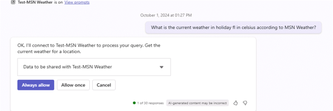

# Exercise: Create a connector action

In this exercise, you will:

- Create a connector action in Copilot Studio
- Test the connector action in Microsoft Teams
- Save and publish the connector action

## Task 1: Create a connector action in Copilot Studio

In this task, you will configure a connector action for the MSN Weather connector.

1. Go to [Copilot Studio](https://copilotstudio.microsoft.com) and sign in with your work or school account, if prompted. Skip any welcome messages.

    **Note:** The first time you open Copilot Studio, it may display a chat interface to create your first copilot. If this happens, select the **…** menu at the top right (next to the **Create** button) then select **Cancel copilot creation** to leave the chat interface and view the Copilot Studio home page.
1. Select **Library** in the left navigation. Here, you can view a list of existing actions and connectors and create a new one.
1. Select **Add an item** at the top.  A menu lists 2 options for extending Copilot for Microsoft 365.
   


3. Select **New action**.
4. Select **Connector** to open the wizard for connector actions.
5. Select **MSN Weather** as the connector.
6. **Review** the description.

    > [!IMPORTANT]
    > This description is very important because Copilot will use this to match the user message with your plugin. If you don't have a good description, Copilot might not trigger your connector action.

1. Select **Next**.
1. Select the **Get current weather** action.
1. **Review** the action description.

    > [!IMPORTANT]
    > Review the action description in the following screen. This action description is very important because Copilot will use this to match the user message with your action. If you don't have a good action description, Copilot might trigger the wrong action.

1. Select **Next**.
1. **Review** the descriptions of all the inputs and outputs.

    > [!IMPORTANT]
    > Review the input and output descriptions in the following screen. These input and output descriptions are very important because Copilot will use these for triggering the connector (inputs) and for writing a good response (outputs) to you. If you don't have a good input and output descriptions, Copilot might not trigger the connector correctly or it will not send back a good response.

1. Select **Next**.
1. Next, you will see a screen where you can add more actions if you want to, but in this case we will skip this and select **Next**.

## Task 2: Test the connector action in Microsoft Teams

In this task, you will test the connector action you configured in task 1 in Microsoft 365 Copilot in Microsoft Teams.


1. Select an existing connection if you have one, or select **New connection** to create a new connection for the MSN Weather connector.
1. On the **New connection** menu, select **Create**.
1. Under **Selected connection**, you can now select your new connection from the dropdown menu.
1. Select the **Test action** button.

    > [!NOTE]
    > This will trigger a process where your connector action will get deployed to Microsoft Teams so that you can test it out.

1. Select **Open to test** to test.

    > [!NOTE]
    > This will open a new browser tab and it will try to launch Microsoft Teams.

1. Feel free to select **Cancel** in the pop-up where it tries to launch Microsoft Teams.
1. Select **Use the web app instead**.

    > [!NOTE]
    > This will open Microsoft 365 Copilot in Microsoft Teams.

1. From the message compose area in Copilot in Teams, select the **plugin** icon next to the send icon.
1. Locate the **Test-MSN Weather** plugin and select the toggle to enable it.

    > [!NOTE]
    > This will show the following message.

    


1.  Submit the following message to Microsoft 365 Copilot, filling in values for your desired location and units.

    ```text
    What is the current weather in <your location> in <celsius/fahrenheit> according to MSN Weather?
    ```

1. If all has gone well, Copilot should respond with a message using the plugin.  

   

   **Note:** Copilot may prompt you for permission before using the plugin.  Select **Always allow** to enable Copilot to use the plugin.

   

## Task 3: Save and publish the connector action

In this task, you will save the connector action and publish it.

Let's pick up where we left off in Copilot Studio.

1. Select **Next** in the wizard and the connector action will be published.

    > [!NOTE]
    > In the next screen, you will be able to go to the details screen or save and close. As indicated in the message, it might take a few minutes for the action to show up in copilot experiences.

      
   
1. Select **Save and Close**.

You now have configured and published your connector action.
