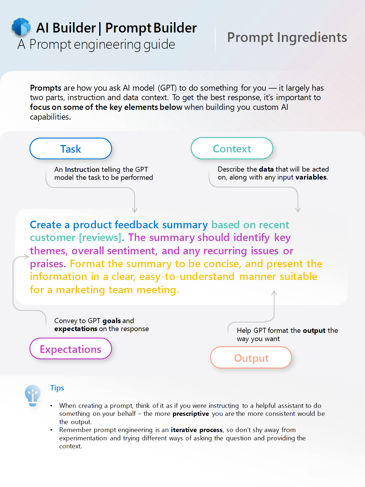

# Exercise: Create a prompt plugin

In this exercise, you learn:

- How to write a good prompt
- How to create the prompt in Copilot Studio
- How to test the prompt in the prompt builder
- How to use the prompt plugin in Microsoft 365 Copilot

## How to write a good prompt

Earlier in this module, you already learned some basics of prompt engineering. A great resource to learn more about prompt engineering is reading the prompt engineering guide from the AI Builder team. The prompt engineering guide can be found [here](https://aka.ms/learn-ai-builder-prompting-guide).

## Elements of a good prompt

The prompt engineering guide from the AI Builder team has a great set of elements that should be part of your prompt.

As you can see, it has the following elements:

- **Task**: an **instruction** telling the Generative Pre-trained Transformer (GPT) model the task to be performed
- **Context**: describe the **data** that is acted on, along with any input **variables**
- **Expectations**: convey to GPT **goals** and **expectations** on the response
- **Output**: help GPT format the **output** the way you want



## Task 1: Design a prompt

In this task, you design a prompt that helps you create a professional development plan based on career milestones.

> [!IMPORTANT]
> When creating a prompt, you don’t have to start from scratch. Although it is very helpful to know how to write a good prompt, it can be helpful to start with something that already gets you halfway there.
> There are prompt samples already available on the [Microsoft Adoption Sample Solution Gallery](https://aka.ms/power-prompts). In this exercise we will use the [Professional Development Plan Prompt sample](https://adoption.microsoft.com/sample-solution-gallery/sample/pnp-powerplatform-prompts-professional-development/).

Let’s add all the prompt ingredients:

- **Task** – Design a professional development plan.
- **Context** – For someone aiming to achieve the following career [milestones].
- **Expectations** – The plan should include goals and objectives, resources, and tools and a timeline for activities.
- **Output** – Format the plan to be concise and actionable and present the information in a clear easy-to-follow manner suitable for a junior level employee.

Together, that would be the following prompt:

*Design a professional development plan for someone aiming to achieve the following career [milestones]. The plan should include goals and objectives, resources, and tools and a timeline for activities. Format the plan to be concise and actionable and present the information in a clear easy-to-follow manner suitable for a junior level employee.*

## Task 2: Create a prompt action in Copilot Studio

Now that you finished writing the prompt, it’s time to enter it in Copilot Studio.

1. In your web browser, navigate to [Copilot Studio](https://copilotstudio.microsoft.com) and sign in with your work or school account, if prompted.  Select **skip** to skip any welcome messages.

    **Note:** The first time you open Copilot Studio, it may display a chat interface to create your first copilot. If this happens, select the **…** menu at the top right (next to the **Create** button) then select **Cancel copilot creation** and then **leave** to leave the chat interface and view the Copilot Studio home page.
1. Select **Library** in the left navigation. Here, you can view a list of existing actions and connectors and create a new one.
1. Select **Add an item** at the top.  A menu lists 2 options for extending Copilot for Microsoft 365.
:::image type="content" source="../Media/extend copilot options.png" alt-text="Window lists 2 options for extending Copilot: create a copilot or create an action.":::
1. Select **New action**.
1. In the *New action* screen, select **Prompt**. This will open the AI Builder prompt builder.
1. On the **Action details** page, enter "Professional Development Plan" as the **action name**.
1. Enter the following **description**: "Creates an actionable professional development plan based on desired career milestones."
1. Select **Next**.
1. In the **prompt** section of the **Add a prompt action** page, enter “Design a professional development plan for someone aiming to achieve the following career [milestones]. The plan should include goals and objectives, resources and tools and a timeline for activities. Format the plan to be concise and actionable and present the information in a clear easy-to-follow manner suitable for a junior level employee.” as the **prompt**.

    > [!NOTE]
    > Notice that there is an information bar at the top that indicates your prompt should have at least one dynamic value

1. Under **Prompt settings** in the right sidebar, open the **Input** section.
1. Select the **Add input** button to add an input.
1. Enter `milestones` as the name of your input.
1. Add the following text as the sample data:

      ```text
      * Become medior in 3 years
      * Have 3 top reviews in a row
      * Become a manager in 10 years
      ```

1. Select **[milestones]** in the prompt section with your cursor.
1. Select **Insert**.
1. Select **milestones**.

      This will change **[milestones]** in a dynamic value.

1. Next, we are ready to test our prompt!

## Task 3: Test the prompt in the prompt builder

1. Select **Test prompt** below the prompt section. This will test the prompt with the sample data you added before.

    > [!NOTE]
    > This will send the prompt to the AI model and show the response in the AI response section. It enables you to see how the LLM responds and to see if you’re happy with the results.

1. When you’re happy with the AI response, select **Save custom prompt** to save the prompt.

    In the next window - you can review the plugin description and the inputs description.

1. On the **Select action parameters** page, change the input description of **milestones** to:

      ```text
      The career milestones that the user wants to achieve
      ```

1. Select **Next**.

1. Select **Publish** to publish your action to Microsoft 365 Copilot.  This may take a minute.

## Task 4: Use the prompt plugin in Microsoft 365 Copilot

Now that you have created your prompt action and tested it, continue to the next task to access it in Microsoft 365 Copilot.  It may take 5 minutes, or longer, for your plugin to appear in Microsoft 365 Copilot.

1. Open [Microsoft Teams](https://teams.microsoft.com).
1. Select the **Copilot** button in the left navigation.
1. Select the **Manage Copilot response** icon at the bottom of the screen (next to where you can send messages to Copilot).
1. Look for **Copilot Studio** in the flyout menu that appeared and confirm that it is toggled to be enabled.  
1. Select **the caret icon** to expand the list of actions under Copilot Studio.

    > [!NOTE]
    > It could be that Copilot Studio is not visible. There can be two reasons for that: either your admin hasn’t deployed the Copilot Studio integrated app or the plugin hasn’t indexed yet – and that could mean you should wait a little while longer.

2. Look for the action with the name **Professional Development Plan** in the list of actions under the Copilot Studio section and select the toggle next to it to enable it.

    > [!NOTE]
    > If you don't see Professional Development Plan in the list of plugins under Copilot Studio, it might take a little while longer to show up. It can take a bit longer to show up in Microsoft 365 Copilot.

3. After enabling the Professional Development Plan action, you can now use it in Copilot. **Try it out** by sending the following message to Copilot in Teams: "I would like to generate a Professional Development Plan to achieve the following career milestones: 1 - become better at my work as a marketer and 2 - have a better chance at getting promoted to the senior marketer role."

**Tip:** To enable developer mode in Copilot, enter `-developer on` in chat.  This allows you to observe when Copilot used a plugin to respond in chat.
